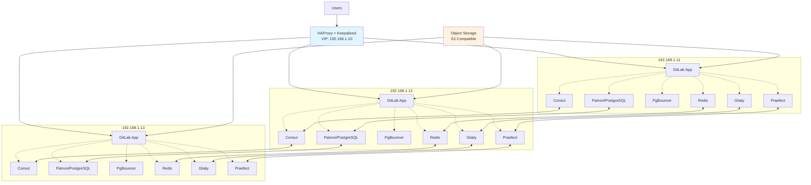

# Triển khai GitLab High Availability trên CentOS 9 bằng Ansible

## 🏗️ Tổng quan kiến trúc GitLab HA

Kiến trúc này triển khai GitLab HA trên 3 node CentOS 9 với các thành phần sau:



## 🔧 Chuẩn bị môi trường

### Yêu cầu hệ thống
- **3 máy chủ CentOS 9 Stream** với tối thiểu 4GB RAM mỗi máy
- **Địa chỉ IP tĩnh** cho mỗi node
- **User với sudo privileges** trên tất cả các node
- **Kết nối Internet** để cài đặt các gói cần thiết

### Cấu trúc thư mục Ansible
Tạo cấu trúc thư mục như sau:

```
gitlab-ha-centos9/
├── inventory/
│   └── hosts.ini
├── group_vars/
│   └── gitlab_ha.yml
├── site.yml
├── roles/
│   ├── base/
│   │   └── tasks/main.yml
│   ├── consul/
│   │   ├── tasks/main.yml
│   │   └── templates/consul.hcl.j2
│   ├── patroni_pg/
│   │   ├── tasks/main.yml
│   │   └── templates/patroni.yml.j2
│   ├── pgbouncer/
│   │   ├── tasks/main.yml
│   │   └── templates/pgbouncer.ini.j2
│   ├── redis_sentinel/
│   │   ├── tasks/main.yml
│   │   ├── templates/redis.conf.j2
│   │   └── templates/sentinel.conf.j2
│   ├── gitaly/
│   │   ├── tasks/main.yml
│   │   └── templates/gitaly.rb.j2
│   ├── praefect/
│   │   ├── tasks/main.yml
│   │   └── templates/praefect.toml.j2
│   ├── gitlab_app/
│   │   ├── tasks/main.yml
│   │   └── templates/gitlab.rb.j2
│   ├── haproxy_keepalived/
│   │   ├── tasks/main.yml
│   │   ├── templates/haproxy.cfg.j2
│   │   └── templates/keepalived.conf.j2
│   └── monitoring/
│       └── tasks/main.yml
└── README.md
```

## 📝 Cấu hình Ansible

### 1. Inventory file
Tạo file `inventory/hosts.ini`:

```ini
[gitlab_ha]
192.168.1.11 node_id=1 hostname=gitlab-01.example.local
192.168.1.12 node_id=2 hostname=gitlab-02.example.local
192.168.1.13 node_id=3 hostname=gitlab-03.example.local
```

### 2. Group variables
Tạo file `group_vars/gitlab_ha.yml`:

```yaml
# Thông tin chung
ansible_user: centos
ansible_become: true

# Tên miền/VIP
external_url: "https://gitlab.example.com"
gitlab_ssh_host: "gitlab.example.com"
git_ssh_port: 22
vip_address: 192.168.1.10
vip_interface: "ens160"       # đổi theo interface của bạn
vip_priority_primary: 150      # node_id=1 làm master VIP mặc định

# Token
redis_password: "CHANGE_ME_STRONG"
postgres_password: "CHANGE_ME_STRONG"
pgbouncer_password: "CHANGE_ME_STRONG"
gitaly_token: "CHANGE_ME_STRONG"
praefect_db_password: "CHANGE_ME_STRONG"
consul_encrypt: "CHANGE_ME_32BYTESKEY=="    # consul key base64 hoặc key 16/32 bytes
consul_datacenter: "dc1"

# S3 Object Storage (khuyến nghị dùng dịch vụ managed)
s3_enabled: true
s3_endpoint: "https://s3.amazonaws.com"     # hoặc endpoint S3 compatible
s3_region: "ap-southeast-1"
s3_access_key: "AKIA..."
s3_secret_key: "..."
s3_bucket_artifacts: "gitlab-artifacts"
s3_bucket_uploads: "gitlab-uploads"
s3_bucket_lfs: "gitlab-lfs"
s3_bucket_packages: "gitlab-packages"
s3_bucket_registry: "gitlab-registry"

# Praefect virtual storage đặt tên 'default'
praefect_virtual_storage: "default"

# Đường dẫn dữ liệu
pg_data_dir: "/var/opt/gitlab/postgresql"
pg_wal_dir: "/var/opt/gitlab/postgresql-wal"
redis_data_dir: "/var/opt/gitlab/redis"
gitaly_data_dir: "/var/opt/gitlab/git-data"

# Phiên bản/gói
omnibus_package_url: "https://packages.gitlab.com/install/repositories/gitlab/gitlab-ee/script.rpm.sh" # hoặc CE
use_ee: false  # true nếu EE

# Ports chuẩn
postgres_port: 5432
pgbouncer_port: 6432
redis_port: 6379
redis_sentinel_port: 26379
gitaly_port: 8075
praefect_port: 2305
http_port: 80
https_port: 443

# Health checks đơn giản
haproxy_backend_timeout: 90s
```

### 3. Playbook chính
Tạo file `site.yml`:

```yaml
- hosts: gitlab_ha
  any_errors_fatal: true
  vars:
    need_reboot: false
  roles:
    - role: base
    - role: consul
    - role: patroni_pg
    - role: pgbouncer
    - role: redis_sentinel
    - role: gitaly
    - role: praefect
    - role: gitlab_app
    - role: haproxy_keepalived
    - role: monitoring
```

## 🎯 Chi tiết các Roles

### Role: base
Tạo file `roles/base/tasks/main.yml`:

```yaml
- name: Cập nhật DNF & cài gói cơ bản
  dnf:
    update_cache: yes
    name:
      - curl
      - gnupg
      - jq
      - python3-psycopg2
      - net-tools
      - htop
      - chrony
      - acl
    state: present

- name: Đồng bộ thời gian
  service:
    name: chronyd
    state: started
    enabled: yes

- name: Tắt swap (khuyến nghị cho DB)
  command: swapoff -a
  when: need_reboot

- name: Đảm bảo fqdn hostname
  hostname:
    name: "{{ hostvars[inventory_hostname].hostname | default(inventory_hostname) }}"

- name: Mở ports trong firewalld
  firewalld:
    port: "{{ item }}/tcp"
    permanent: yes
    state: enabled
    immediate: yes
  loop:
    - "{{ http_port }}"
    - "{{ https_port }}"
    - "{{ git_ssh_port }}"
    - "{{ postgres_port }}"
    - "{{ pgbouncer_port }}"
    - "{{ redis_port }}"
    - "{{ redis_sentinel_port }}"
    - "{{ gitaly_port }}"
    - "{{ praefect_port }}"
  ignore_errors: yes
```

### Role: consul
Tạo file `roles/consul/tasks/main.yml`:

```yaml
- name: Cài đặt Consul
  dnf:
    name: https://releases.hashicorp.com/consul/1.19.1/consul-1.19.1_linux_amd64.rpm
    state: present

- name: Tạo thư mục cấu hình
  file:
    path: /etc/consul.d
    state: directory
    mode: '0755'

- name: Render cấu hình Consul
  template:
    src: consul.hcl.j2
    dest: /etc/consul.d/consul.hcl
    mode: '0644'
  notify: restart consul

- name: Tạo service systemd
  copy:
    dest: /etc/systemd/system/consul.service
    mode: '0644'
    content: |
      [Unit]
      Description=Consul Agent
      After=network-online.target
      Wants=network-online.target
      [Service]
      ExecStart=/usr/bin/consul agent -config-file=/etc/consul.d/consul.hcl
      Restart=on-failure
      LimitNOFILE=65536
      [Install]
      WantedBy=multi-user.target

- name: Khởi động Consul
  systemd:
    name: consul
    state: started
    enabled: yes
```

Tạo file `roles/consul/templates/consul.hcl.j2`:

```hcl
server = true
datacenter = "{{ consul_datacenter }}"
data_dir = "/var/lib/consul"
bootstrap_expect = 3
encrypt = "{{ consul_encrypt }}"
retry_join = [
  "192.168.1.11",
  "192.168.1.12",
  "192.168.1.13"
]
bind_addr = "{{ ansible_default_ipv4.address }}"
client_addr = "0.0.0.0"
ui_config { enabled = true }
```

### Role: patroni_pg
Tạo file `roles/patroni_pg/tasks/main.yml`:

```yaml
- name: Cài đặt gpg & repo GitLab Omnibus
  shell: |
    curl -s {{ omnibus_package_url }} | bash
  args:
    creates: /etc/yum.repos.d/gitlab_gitlab-*.repo

- name: Cài đặt PostgreSQL dependencies
  dnf:
    name:
      - gitlab-common
      - procps
      - patroni
      - python3-psycopg2
    state: present

- name: Tạo thư mục dữ liệu
  file:
    path: "{{ item }}"
    state: directory
    owner: gitlab-psql
    group: gitlab-psql
    mode: '0750'
  loop:
    - "{{ pg_data_dir }}"
    - "{{ pg_wal_dir }}"

- name: Render cấu hình Patroni
  template:
    src: patroni.yml.j2
    dest: /etc/patroni.yml
    mode: '0644'
  notify: restart patroni

- name: Tạo service Patroni
  copy:
    dest: /etc/systemd/system/patroni.service
    mode: '0644'
    content: |
      [Unit]
      Description=Patroni PostgreSQL
      After=network.target consul.service
      [Service]
      ExecStart=/usr/bin/patroni /etc/patroni.yml
      Restart=on-failure
      User=gitlab-psql
      [Install]
      WantedBy=multi-user.target

- name: Khởi động Patroni
  systemd:
    name: patroni
    state: started
    enabled: yes
```

Tạo file `roles/patroni_pg/templates/patroni.yml.j2`:

```yaml
scope: gitlab-pg
namespace: /service/
name: "pg-{{ hostvars[inventory_hostname].node_id }}"
dcs:
  consul:
    host: 127.0.0.1:8500
    ttl: 30
    loop_wait: 10
    retry_timeout: 10
    maximum_lag_on_failover: 1048576
restapi:
  listen: 0.0.0.0:8008
  connect_address: {{ ansible_default_ipv4.address }}:8008
postgresql:
  listen: 0.0.0.0:{{ postgres_port }}
  connect_address: {{ ansible_default_ipv4.address }}:{{ postgres_port }}
  data_dir: {{ pg_data_dir }}
  bin_dir: /usr/pgsql-14/bin
  parameters:
    wal_level: replica
    hot_standby: "on"
    max_wal_senders: 10
    max_replication_slots: 10
    shared_buffers: "2GB"
    work_mem: "64MB"
    maintenance_work_mem: "256MB"
    effective_cache_size: "6GB"
    wal_keep_size: "1024"
  authentication:
    replication:
      username: replicator
      password: "{{ postgres_password }}"
    superuser:
      username: postgres
      password: "{{ postgres_password }}"
    rewind:
      username: rewind
      password: "{{ postgres_password }}"
bootstrap:
  dcs:
    synchronous_mode: true
    synchronous_node_count: 1
  method: initdb
  initdb:
  - encoding: UTF8
  - data-checksums
  users:
    gitlab:
      password: "{{ postgres_password }}"
      options:
      - CREATEDB
      - CREATEROLE
watchdog:
  mode: off
```

### Role: pgbouncer
Tạo file `roles/pgbouncer/tasks/main.yml`:

```yaml
- name: Cài PgBouncer
  dnf:
    name: pgbouncer
    state: present

- name: Render pgbouncer.ini
  template:
    src: pgbouncer.ini.j2
    dest: /etc/pgbouncer/pgbouncer.ini
  notify: restart pgbouncer

- name: Tạo users.txt
  copy:
    dest: /etc/pgbouncer/users.txt
    mode: '0600'
    content: |
      "gitlab" "{{ pgbouncer_password }}"
      "praefect" "{{ pgbouncer_password }}"

- name: Khởi động PgBouncer
  systemd:
    name: pgbouncer
    state: started
    enabled: yes
```

Tạo file `roles/pgbouncer/templates/pgbouncer.ini.j2`:

```ini
[databases]
gitlabhq_production = host=127.0.0.1 port={{ postgres_port }} user=gitlab dbname=gitlabhq_production
praefect_production = host=127.0.0.1 port={{ postgres_port }} user=praefect dbname=praefect_production

[pgbouncer]
listen_addr = 0.0.0.0
listen_port = {{ pgbouncer_port }}
pool_mode = session
max_client_conn = 2000
server_tls_sslmode = disable
auth_type = plain
auth_file = /etc/pgbouncer/users.txt
admin_users = postgres,gitlab
```

### Role: redis_sentinel
Tạo file `roles/redis_sentinel/tasks/main.yml`:

```yaml
- name: Cài Redis
  dnf:
    name: redis
    state: present

- name: Render redis.conf
  template:
    src: redis.conf.j2
    dest: /etc/redis/redis.conf
  notify: restart redis

- name: Khởi động Redis
  systemd:
    name: redis
    state: started
    enabled: yes

- name: Render sentinel.conf
  template:
    src: sentinel.conf.j2
    dest: /etc/redis/sentinel.conf
  notify: restart redis-sentinel

- name: Service Sentinel
  copy:
    dest: /etc/systemd/system/redis-sentinel.service
    mode: '0644'
    content: |
      [Unit]
      Description=Redis Sentinel
      After=network.target
      [Service]
      ExecStart=/usr/bin/redis-server /etc/redis/sentinel.conf --sentinel
      Restart=always
      [Install]
      WantedBy=multi-user.target

- name: Khởi động Sentinel
  systemd:
    name: redis-sentinel
    state: started
    enabled: yes
```

Tạo file `roles/redis_sentinel/templates/redis.conf.j2`:

```conf
bind 0.0.0.0
port {{ redis_port }}
requirepass {{ redis_password }}
appendonly yes
dir {{ redis_data_dir }}
```

Tạo file `roles/redis_sentinel/templates/sentinel.conf.j2`:

```conf
port {{ redis_sentinel_port }}
sentinel monitor gitlab-redis 192.168.1.11 {{ redis_port }} 2
sentinel auth-pass gitlab-redis {{ redis_password }}
sentinel down-after-milliseconds gitlab-redis 5000
sentinel parallel-syncs gitlab-redis 1
sentinel failover-timeout gitlab-redis 60000
```

### Role: gitaly
Tạo file `roles/gitaly/tasks/main.yml`:

```yaml
- name: Cài omnibus gitlab (để lấy gitaly, gitlab-shell, ruby env)
  dnf:
    name: "{{ 'gitlab-ee' if use_ee else 'gitlab-ce' }}"
    state: present

- name: Tạo thư mục dữ liệu Gitaly
  file:
    path: "{{ gitaly_data_dir }}"
    state: directory
    owner: git
    group: git
    mode: '0750'

- name: Render gitaly.rb
  template:
    src: gitaly.rb.j2
    dest: /etc/gitlab/gitaly.rb
  notify: reconfigure gitlab

- name: Reconfigure chỉ Gitaly
  shell: gitlab-ctl reconfigure
  when: gitaly_config_changed | default(false)
```

Tạo file `roles/gitaly/templates/gitaly.rb.j2`:

```ruby
gitaly['enable'] = true
gitaly['listen_addr'] = "0.0.0.0:{{ gitaly_port }}"
# khuyến nghị TLS trong production
# gitaly['auth_token'] = "{{ gitaly_token }}"
# đường dẫn repo
git_data_dirs({
  "default" => { "path" => "{{ gitaly_data_dir }}" }
})
```

### Role: praefect
Tạo file `roles/praefect/tasks/main.yml`:

```yaml
- name: Render praefect.toml
  template:
    src: praefect.toml.j2
    dest: /etc/gitlab/praefect.toml
  notify: reconfigure gitlab

- name: Tạo DB praefect (qua PgBouncer)
  shell: |
    psql "host=127.0.0.1 port={{ pgbouncer_port }} user=gitlab password={{ pgbouncer_password }} dbname=postgres" \
    -c "CREATE USER praefect WITH PASSWORD '{{ pgbouncer_password }}';" || true
    psql "host=127.0.0.1 port={{ pgbouncer_port }} user=gitlab password={{ pgbouncer_password }} dbname=postgres" \
    -c "CREATE DATABASE praefect_production OWNER praefect;" || true

- name: Reconfigure praefect
  shell: gitlab-ctl reconfigure
  when: praefect_config_changed | default(false)
```

Tạo file `roles/praefect/templates/praefect.toml.j2`:

```toml
[postgresql]
host = "127.0.0.1"
port = {{ pgbouncer_port }}
dbname = "praefect_production"
user = "praefect"
password = "{{ pgbouncer_password }}"

[virtual_storage."{{ praefect_virtual_storage }}"]
# 3 nodes gitaly
nodes = [
  { address = "tcp://192.168.1.11:{{ gitaly_port }}", token = "{{ gitaly_token }}" },
  { address = "tcp://192.168.1.12:{{ gitaly_port }}", token = "{{ gitaly_token }}" },
  { address = "tcp://192.168.1.13:{{ gitaly_port }}", token = "{{ gitaly_token }}" }
]

[auth]
token = "{{ gitaly_token }}"

[failover]
# có thể tinh chỉnh: election strategy, quorum, backoff
```

### Role: gitlab_app
Tạo file `roles/gitlab_app/tasks/main.yml`:

```yaml
- name: Cài omnibus gitlab app
  dnf:
    name: "{{ 'gitlab-ee' if use_ee else 'gitlab-ce' }}"
    state: present

- name: Render gitlab.rb
  template:
    src: gitlab.rb.j2
    dest: /etc/gitlab/gitlab.rb
  notify: reconfigure gitlab

- name: Reconfigure GitLab app
  shell: gitlab-ctl reconfigure
  when: gitlab_config_changed | default(false)
```

Tạo file `roles/gitlab_app/templates/gitlab.rb.j2`:

```ruby
external_url "{{ external_url }}"

# SSH
gitlab_rails['gitlab_ssh_host'] = "{{ gitlab_ssh_host }}"
gitlab_rails['gitlab_shell_ssh_port'] = {{ git_ssh_port }}

# DB qua PgBouncer local
postgresql['enable'] = false
pgbouncer['enable'] = true
pgbouncer['listen_addr'] = "0.0.0.0"
pgbouncer['listen_port'] = {{ pgbouncer_port }}

# App kết nối PgBouncer (localhost)
gitlab_rails['db_adapter'] = 'postgresql'
gitlab_rails['db_host'] = '127.0.0.1'
gitlab_rails['db_port'] = {{ pgbouncer_port }}
gitlab_rails['db_username'] = 'gitlab'
gitlab_rails['db_password'] = '{{ pgbouncer_password }}'

# Redis Sentinel list
redis['enable'] = false
sentinel_hosts = [
  '192.168.1.11:{{ redis_sentinel_port }}',
  '192.168.1.12:{{ redis_sentinel_port }}',
  '192.168.1.13:{{ redis_sentinel_port }}'
]

# GitLab sidekiq/rails config tới Sentinel
gitlab_rails['redis_sentinels'] = sentinel_hosts
gitlab_rails['redis_master_name'] = 'gitlab-redis'
gitlab_rails['redis_password'] = '{{ redis_password }}'

# Gitaly qua Praefect
gitlab_rails['gitaly_token'] = '{{ gitaly_token }}'
git_data_dirs({
  "{{ praefect_virtual_storage }}" => {"gitaly_address" => "tcp://127.0.0.1:{{ praefect_port }}"}
})

# Object Storage
{{ '# S3 conf' if s3_enabled else '# S3 disabled' }}

gitlab_rails['object_store'] = {
  'enabled' => true,
  'connection' => {
    'provider' => 'AWS',
    'aws_access_key_id' => '{{ s3_access_key }}',
    'aws_secret_access_key' => '{{ s3_secret_key }}',
    'region' => '{{ s3_region }}',
    'endpoint' => '{{ s3_endpoint }}'
  }
}
gitlab_rails['artifacts_object_store_enabled'] = true
gitlab_rails['artifacts_object_store_remote_directory'] = '{{ s3_bucket_artifacts }}'
gitlab_rails['uploads_object_store_enabled'] = true
gitlab_rails['uploads_object_store_remote_directory'] = '{{ s3_bucket_uploads }}'
gitlab_rails['lfs_object_store_enabled'] = true
gitlab_rails['lfs_object_store_remote_directory'] = '{{ s3_bucket_lfs }}'
gitlab_rails['packages_object_store_enabled'] = true
gitlab_rails['packages_object_store_remote_directory'] = '{{ s3_bucket_packages }}'
registry_external_url "https://registry.gitlab.example.com"
registry['storage'] = {
  's3' => {
    'bucket' => '{{ s3_bucket_registry }}',
    'region' => '{{ s3_region }}',
    'accesskey' => '{{ s3_access_key }}',
    'secretkey' => '{{ s3_secret_key }}',
    'endpoint' => '{{ s3_endpoint }}'
  }
}


# Praefect proxy lắng nghe local (qua HAProxy hoặc trực tiếp)
praefect['enable'] = true
praefect['listen_addr'] = "0.0.0.0:{{ praefect_port }}"
# praefect['auth_token'] = "{{ gitaly_token }}"
```

### Role: haproxy_keepalived
Tạo file `roles/haproxy_keepalived/tasks/main.yml`:

```yaml
- name: Cài HAProxy & Keepalived
  dnf:
    name:
      - haproxy
      - keepalived
    state: present

- name: Render haproxy.cfg
  template:
    src: haproxy.cfg.j2
    dest: /etc/haproxy/haproxy.cfg
  notify: restart haproxy

- name: Render keepalived.conf (ưu tiên node_id=1)
  template:
    src: keepalived.conf.j2
    dest: /etc/keepalived/keepalived.conf
  notify: restart keepalived

- name: Enable & start services
  systemd:
    name: "{{ item }}"
    state: started
    enabled: yes
  loop:
    - haproxy
    - keepalived
```

Tạo file `roles/haproxy_keepalived/templates/haproxy.cfg.j2`:

```haproxy
global
log /dev/log local0
maxconn 20000

defaults
mode http
timeout connect 10s
timeout client {{ haproxy_backend_timeout }}
timeout server {{ haproxy_backend_timeout }}

# HTTPS passthrough/termination tuỳ bạn. Ở đây demo HTTP -> backend HTTP (đơn giản)
frontend fe_http
bind *:{{ http_port }}
default_backend be_gitlab

backend be_gitlab
option httpchk GET /-/health
server app1 192.168.1.11:{{ http_port }} check
server app2 192.168.1.12:{{ http_port }} check
server app3 192.168.1.13:{{ http_port }} check

# TCP cho SSH
frontend fe_ssh
bind *:{{ git_ssh_port }}
mode tcp
default_backend be_ssh

backend be_ssh
mode tcp
server ssh1 192.168.1.11:{{ git_ssh_port }} check
server ssh2 192.168.1.12:{{ git_ssh_port }} check
server ssh3 192.168.1.13:{{ git_ssh_port }} check

# gRPC Praefect (tuỳ bạn tách riêng)
frontend fe_praefect
bind *:{{ praefect_port }}
mode tcp
default_backend be_praefect

backend be_praefect
mode tcp
server pr1 192.168.1.11:{{ praefect_port }} check
server pr2 192.168.1.12:{{ praefect_port }} check
server pr3 192.168.1.13:{{ praefect_port }} check
```

Tạo file `roles/haproxy_keepalived/templates/keepalived.conf.j2`:

```conf
vrrp_instance VI_1 {
state {{ 'MASTER' if (hostvars[inventory_hostname].node_id | int) == 1 else 'BACKUP' }}
interface {{ vip_interface }}
virtual_router_id 51
priority {{ vip_priority_primary if (hostvars[inventory_hostname].node_id | int) == 1 else 100 + (3 - (hostvars[inventory_hostname].node_id | int)) }}
advert_int 1
authentication {
auth_type PASS
auth_pass 42secret
}
virtual_ipaddress {
{{ vip_address }}/24
}
}
```

### Role: monitoring
Tạo file `roles/monitoring/tasks/main.yml`:

```yaml
- name: Cài node_exporter
  dnf:
    name: golang-github-prometheus-node-exporter
    state: present

- name: Start node_exporter
  systemd:
    name: node_exporter
    state: started
    enabled: yes
```

## 🚀 Thực thi triển khai

### 1. Cài đặt Ansible
Trên máy chủ điều khiển (control node):

```bash
# Cài đặt Python và pip
sudo dnf install python3 python3-pip -y

# Tạo virtual environment
python3 -m venv gitlab-ansible-env
source gitlab-ansible-env/bin/activate

# Cài đặt Ansible
pip install ansible

# Cài đặt collections cần thiết
ansible-galaxy collection install community.general
```

### 2. Chuẩn bị SSH keys
Đảm bảo máy chủ điều khiển có thể SSH đến tất cả các node GitLab mà không cần password:

```bash
# Tạo SSH key (nếu chưa có)
ssh-keygen -t rsa -b 4096 -C "ansible-gitlab"

# Copy key đến tất cả các node
ssh-copy-id centos@192.168.1.11
ssh-copy-id centos@192.168.1.12
ssh-copy-id centos@192.168.1.13
```

### 3. Chạy playbook
```bash
# Kiểm tra kết nối
ansible -i inventory/hosts.ini gitlab_ha -m ping

# Triển khai GitLab HA
ansible-playbook -i inventory/hosts.ini site.yml
```

## ✅ Kiểm tra và xác thực

Sau khi triển khai hoàn tất, thực hiện các bước kiểm tra sau:

### 1. Kiểm tra trạng thái dịch vụ
```bash
# Kiểm tra Consul
ansible gitlab_ha -i inventory/hosts.ini -m shell -a "consul members"

# Kiểm tra Patroni
ansible gitlab_ha -i inventory/hosts.ini -m shell -a "patronictl list"

# Kiểm tra Redis Sentinel
ansible gitlab_ha -i inventory/hosts.ini -m shell -a "redis-cli -p 26379 SENTINEL get-master-addr-by-name gitlab-redis"

# Kiểm tra GitLab
ansible gitlab_ha -i inventory/hosts.ini -m shell -a "gitlab-ctl status"
```

### 2. Kiểm tra Virtual IP
```bash
# Kiểm tra VIP trên node master
ansible gitlab_ha -i inventory/hosts.ini -m shell -a "ip a | grep {{ vip_address }}"
```

### 3. Truy cập GitLab
Mở trình duyệt và truy cập `http://gitlab.example.com` (hoặc HTTPS nếu đã cấu hình) qua VIP `192.168.1.10`.

### 4. Kiểm tra health endpoints
```bash
curl http://gitlab.example.com/-/health
curl http://gitlab.example.com/-/readiness
curl http://gitlab.example.com/-/liveness
```

## 🔧 Kiểm thử High Availability

### 1. Test DB failover
```bash
# Dừng Patroni trên node leader
ansible 192.168.1.11 -i inventory/hosts.ini -m shell -a "systemctl stop patroni"

# Kiểm tra failover
ansible gitlab_ha -i inventory/hosts.ini -m shell -a "patronictl list"
```

### 2. Test Redis failover
```bash
# Dừng Redis master
ansible 192.168.1.11 -i inventory/hosts.ini -m shell -a "systemctl stop redis"

# Kiểm tra master mới
ansible gitlab_ha -i inventory/hosts.ini -m shell -a "redis-cli -p 26379 SENTINEL get-master-addr-by-name gitlab-redis"
```

### 3. Test Gitaly failover
```bash
# Dừng Gitaly trên một node
ansible 192.168.1.11 -i inventory/hosts.ini -m shell -a "gitlab-ctl stop gitaly"

# Thử clone/push repo
git clone http://gitlab.example.com/group/project.git
```

### 4. Test HAProxy/Keepalived failover
```bash
# Shutdown máy giữ VIP
ansible 192.168.1.11 -i inventory/hosts.ini -m shell -a "shutdown -h now"

# Kiểm tra VIP chuyển node
ansible gitlab_ha -i inventory/hosts.ini -m shell -a "ip a | grep {{ vip_address }}"
```

## 📋 Runbook xử lý sự cố

### Database (Patroni)
- **Phát hiện:** API Patroni `:8008` trả leader/followers. Log tại `/var/log/messages` và `patronictl list`.
- **Leader down:** 
  - Xác nhận quorum Consul OK (`consul members`)
  - Patroni sẽ tự failover (synchronous_mode=true). Đợi tối đa 30-60s
  - Nếu không failover: `patronictl failover` từ 1 follower đủ điều kiện
- **Khôi phục leader cũ:** Khởi động lại dịch vụ Patroni, nó sẽ join thành follower

### Redis/Sentinel
- **Phát hiện:** `redis-cli -p 26379 SENTINEL get-master-addr-by-name gitlab-redis`
- **Master down:** Sentinel chọn master mới; không đổi cấu hình app
- **Sự cố auth:** Kiểm tra `requirepass` và `auth-pass` đồng nhất

### Gitaly/Praefect
- **Repo lỗi:** Kiểm tra `gitlab-rake gitlab:check GITLAB_LOG_LEVEL=debug`
- **Node Gitaly down:** Praefect phục vụ từ node còn lại; kiểm tra đồng bộ
- **Metadata Praefect:** DB `praefect_production` phải hoạt động qua PgBouncer

### HAProxy/Keepalived
- **VIP mất:** `ip a | grep {{ vip_address }}` trên 3 node
- **LB lỗi health check:** Xem `/var/log/haproxy/log`

## 🔄 Nâng cấp không downtime

1. **Ứng dụng (Omnibus):** Rolling từng node, theo thứ tự: app → praefect/gitaly → haproxy
2. **Database:** Dùng Patroni để điều phối switchover
3. **Redis:** Nâng cấp replica trước, chuyển role, cuối cùng nâng cấp node còn lại

## 🔒 Bảo mật và hardening

1. Bật HTTPS end-to-end (HAProxy TLS termination + mTLS Gitaly)
2. Hạn chế SSH bằng Fail2ban/SecurityGroup
3. Bật firewalld chỉ cho phép port cần thiết
4. Thay toàn bộ mật khẩu/token mặc định trong `group_vars`
5. Theo dõi CVE GitLab/Redis/PostgreSQL định kỳ

## 💡 Lưu ý quan trọng

1. **3 node đủ quorum** cho Consul/Redis/Praefect, nhưng không thay thế được DR/Geo
2. **Hiệu năng phụ thuộc IOPS** của Gitaly. Ưu tiên SSD/NVMe, `noatime`
3. **Runners nên tách ra** cụm riêng; cache/logs của Runner dùng S3
4. **Backup chiến lược:** WAL, Database, Repo, và Object Storage lifecycle