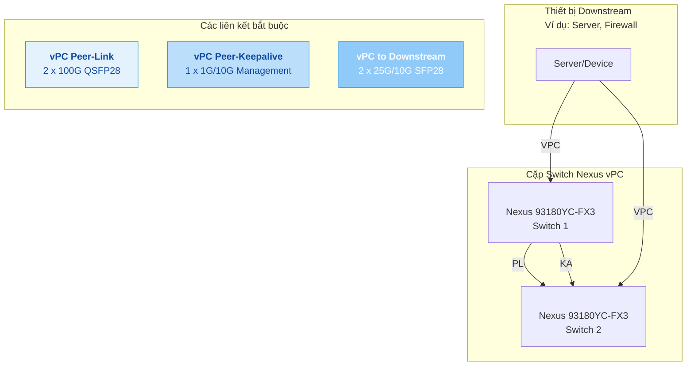
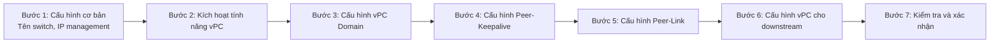

## Tổng quan về Virtual Port Channel (vPC)

Để cấu hình một cặp switch Cisco Nexus N9K-C93180YC-FX3 hoạt động dự phòng (High Availability - HA), phương án tối ưu và được khuyến nghị nhất là sử dụng **Virtual Port Channel (vPC)**. vPC cho phép hai switch Nexus hoạt động như một logical switch đối với các thiết bị downstream, cung cấp khả năng dự phòng và sử dụng đường truyền active-active, tối ưu hóa băng thông.

vPC là công nghệ độc quyền của Cisco, cho phép hai switch Nexus kết nối với một thiết bị (như server, another switch) qua một Port Channel duy nhất, dù các liên kết vật lý được cắm vào hai switch khác nhau. Điều này loại bỏ vòng lặp Spanning Tree Protocol (STP) và cho phép cả hai đường truyền hoạt động đồng thời.

## So sánh các phương án High Availability

| Phương án | Mô tả | Ưu điểm | Nhược điểm | Độ phù hợp |
| :--- | :--- | :--- | :--- | :--- |
| **vPC (Khuyến nghị)** | Hai switch hoạt động như một logical switch, active-active | **Tối ưu băng thông**, không có block STP, chuyển đổi nhanh khi lỗi | Cấu hình phức tạp hơn, cần kiến thức về vPC | **Rất cao** - Tiêu chuẩn cho data center |
| **Stacking** | Các switch nối vật lý thành một logical switch | Quản lý đơn giản như một switch | **Không được hỗ trợ** trên dòng Nexus 9300 | Không áp dụng |
| **STP với các vai trò khác nhau** | Một switch làm Root, một làm Backup | Đơn giản | **Chỉ sử dụng một đường dẫn**, lãng phí băng thông | Thấp - Chỉ cho môi trường nhỏ, không yêu cầu hiệu năng cao |

---

## Phương án tối ưu: Cấu hình vPC cho N9K-C93180YC-FX3

### Sơ đồ kết nối vật lý

Để đảm bảo dự phòng, bạn cần thiết lập các liên kết sau:



### Yêu cầu về kết nối

1. **vPC Peer-Link**: Liên kết quan trọng nhất, dùng để đồng bộ hóa trạng thái giữa hai switch.
   - **Khuyến nghị**: Sử dụng **tối thiểu 2 cổng 100G** (từ các cổng QSFP28 49-54) và cấu hình thành một Port Channel.
   - **Lưu ý**: Peer-Link phải là trunk và cho phép tất cả VLAN cần thiết.

2. **vPC Peer-Keepalive**: Liên kết giám sát trạng thái sống của peer switch.
   - **Khuyến nghị**: Sử dụng các cổng quản lý (`mgmt0`) hoặc một cổng Layer 3 riêng. **Không nên** đi chung với Peer-Link.
   - **Mục đích**: Gửi các gói tin heartbeat để phát hiện khi peer switch bị lỗi. Nếu Keepalive thất bại nhưng Peer-Link vẫn lên, vPC vẫn hoạt động để tránh "split-brain".

3. **vPC to Downstream**: Các Port Channel từ hai switch đến thiết bị downstream.
   - **Khuyến nghị**: Sử dụng các cổng SFP28 1-48. Cấu hình Port Channel trên cả hai switch với cùng `vPC domain ID`.

### Các bước cấu hình tổng quan

Dưới đây là các bước cấu hình vPC trên cả hai switch (giả sử Switch 1 và Switch 2).



#### Bước 1: Cấu hình cơ bản

- Đặt tên host, cấu hình IP cho cổng quản lý `mgmt0`, tạo VLAN cần thiết.
- Đảm bảo cả hai switch có cấu hình đồng nhất về VLAN, Port Channel, vPC.

#### Bước 2: Kích hoạt tính năng vPC

```bash
feature vpc
feature interface-vlan
feature lacp
```

#### Bước 3: Cấu hình vPC Domain

Trên cả hai switch, đặt cùng `vPC domain ID` (từ 1-4094). Mỗi switch cần có `role priority` khác nhau để xác định switch nào là primary.

```bash
! Trên Switch 1 (Primary)
vpc domain 100
  role priority 1

! Trên Switch 2 (Secondary)
vpc domain 100
  role priority 200
```

#### Bước 4: Cấu hình Peer-Keepalive

Sử dụng IP của cổng quản lý.

```bash
! Trên Switch 1
interface mgmt0
  ip address 192.168.1.1/24
vpc domain 100
  peer-keepalive destination 192.168.1.2

! Trên Switch 2
interface mgmt0
  ip address 192.168.1.2/24
vpc domain 100
  peer-keepalive destination 192.168.1.1
```

#### Bước 5: Cấu hình Peer-Link

Sử dụng các cổng QSFP28 (ví dụ port 53, 54).

```bash
! Cấu hình trên cả hai switch
interface ethernet 1/53-54
  channel-group 10 mode active
interface port-channel 10
  switchport mode trunk
  vpc peer-link
```

#### Bước 6: Cấu hình vPC cho downstream

Ví dụ kết nối đến server qua port 1.

```bash
! Cấu hình trên cả hai switch
interface ethernet 1/1
  channel-group 20 mode active
interface port-channel 20
  switchport access vlan 10
  vpc 20
```

#### Bước 7: Kiểm tra và xác nhận

Sử dụng các lệnh để kiểm tra trạng thái vPC.

```bash
show vpc brief
show vpc consistency-parameters
show vpc role
```

---

## Các vấn đề thường gặp và cách khắc phục

Dưới đây là một số vấn đề đã được ghi nhận và hướng giải quyết.

| Vấn đề/Bug | Mô tả | Hướng giải quyết |
| :--- | :--- | :--- |
| **Auto-negotiation ở tốc độ 10G** | Switch **không hỗ trợ** auto-negotiation ở tốc độ 10G trên các cổng SFP28 (1-48) và QSFP28 (49-52) khi dùng adapter QSA. | **Cấu hình tốc độ tĩnh** `speed 1000` hoặc `speed 25000` trên cả hai switch và thiết bị downstream. Không dùng `speed 10000`. |
| **Hỏng quạt (Fan Failure)** | Switch hoạt động với chế độ dự phòng +1. Nếu 1 quạt lỗi vẫn hoạt động, nhưng nếu **quạt thứ hai lỗi, switch sẽ tự tắt** để tránh quá nhiệt. | **Thay thế quạt lỗi ngay lập tức**. Sử dụng module quạt đúng hướng khí (intake/exhaust) cho tủ rack. |
| **VPC inconsistency** | Cấu hình không đồng nhất giữa hai switch (ví dụ VLAN, MTU, allowed VLAN list trên Port Channel) sẽ gây lỗi vPC inconsistency và Port Channel sẽ bị suspend. | Luôn dùng lệnh `show vpc consistency-parameters` để kiểm tra. Đảm bảo mọi cấu hình liên quan phải **giống hệt nhau** trên cả hai switch. |
| **Split-brain scenario** | Khi Peer-Keepalive và Peer-Link đều bị ngắt, cả hai switch đều nghĩ mình là primary và hoạt động độc lập, gây ra vấn đề về mạng. | Sử dụng các cơ chế phát hiện như **vPC auto-recovery** (cần phiên bản NX-OS hỗ trợ) và cấu hình chính sách keepalive. |
| **Các Field Notice** | Có các thông báo về phần cứng và phần mềm, ví dụ FN72464 (liên quan đến SSD) và FN72433 (liên quan đến phiên bản phần mềm). | **Kiểm tra các Field Notice** cho model N9K-C93180YC-FX3 trên trang hỗ trợ của Cisco và nâng cấp lên phiên bản NX-OS được khuyến nghị. |

---

## Lời khuyên và các bước kiểm tra trước khi triển khai

1. **Kiểm tra phiên bản NX-OS**: Luôn sử dụng phiên bản NX-OS ổn định và được Cisco khuyến nghị cho model này. Tránh các phiên bản có bug nghiêm trọng đã được công bố.

2. **Lập kế hoạch bảo trì**: Lên kế hoạch nâng cấp phần mềm cho cặp vPC. Tham khảo tài liệu nâng cấp của Cisco để thực hiện một cách an toàn nhất.

3. **Sao lưu cấu hình**: Luôn sao lưu cấu hình trước khi thay đổi.

4. **Môi trường lab**: Nếu có thể, hãy thử nghiệm cấu hình vPC trong môi trường lab trước khi triển khai thực tế.

5. **Sử dụng Cisco Bug Search Tool**: Trước khi nâng cấp, hãy tìm kiếm các bug đã biết cho phiên bản NX-OS bạn định sử dụng trên model N9K-C93180YC-FX3.

## Kết luận

Sử dụng **vPC** là phương án HA tối ưu nhất cho cặp switch Nexus N9K-C93180YC-FX3, mang lại hiệu năng cao và khả năng chuyển đổi mượt mà. Chìa khóa thành công là **lập kế hoạch kỹ lưỡng**, **đảm bảo cấu hình đồng nhất**, và **kiểm tra thường xuyên** trạng thái hệ thống.

Chúc bạn triển khai thành công! Nếu có câu hỏi cụ thể về các bước cấu hình, đừng ngần ngại hỏi thêm nhé.